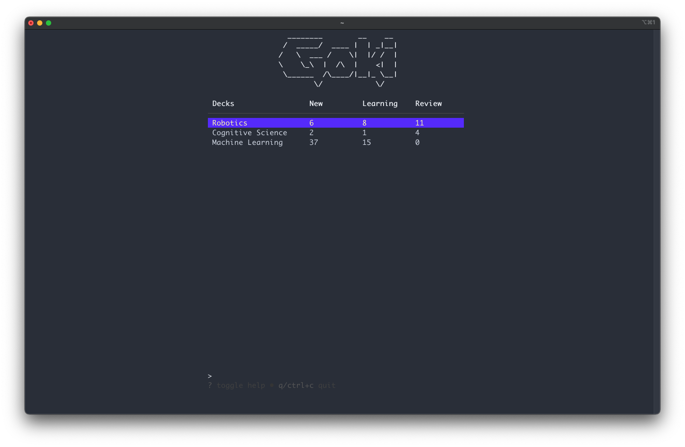

# Goki

A terminal-based spaced repetition flashcard tool. 

## Now supports OpenAI API Integration and...

- **Importing decks from Anki and csv's!**
- **Reviewing from TUI and Terminal!**



Theme: [material default-community](https://github.com/kaicataldo/material.vim)

Goki is an intelligent flashcard management tool inspired by 
[Anki](https://apps.ankiweb.net/) built in the terminal!

## Table of contents

- [TUI Demo](#tui-demo)
- [Key Mappings](#key-mappings)
- [Installation](#installation)
- [Examples](#examples)
    - [OpenAI API Integration](#openai-api-integration)
    - [Import Flashcards](#import-from-csv)
    - [Reviewing Flashcards](#reviewing-flashcards)
    - [Creating Decks](#creating-decks)
    - [Creating Flashcards](#creating-flashcards)
- [Commands](#commands)
- [Resources](#resources)

## TUI Demo

Launch by running `goki`:

https://github.com/abeleinin/goki/assets/95333017/91d46c80-6580-4550-b6c2-405342a48290

Goki features a [Spaced Repetion Algorithm](https://en.wikipedia.org/wiki/Spaced_repetition)
which uses user feedback on card difficulty to effectively space out practice sessions.

## Key Mappings

<details>
<summary>Home Page</summary>

| Action       | Keybinding |
|--------------|------------|
| Review Decks Flashcards | `r`        |
| Create New Deck         | `N`        |
| Generate a Deck using GPT | `G`        |
| View Deck Card List     | `o`        |
| Edit Deck Name          | `e`        |
| Delete Deck      | `d`        |
| Move Up          | `up arrow`,`k`      |
| Move Down        | `down arrow`,`j`      |
| Toggle Help Menu      | `?`        |
| Quit             | `q`,`ctrl+c` |

</details>

<details>
<summary>Flashcard List Page</summary>

| Action           | Keybinding |
|------------------|------------|
| Move Up          | `up arrow`,`k`      |
| Move Down        | `down arrow`,`j`      |
| Next page        | `right arrow`,`l`      |
| Previous Page    | `left arrow`,`h`      |
| Search Flashcards | `/`        |
| New Card     | `n`        |
| Edit Card    | `e`        |
| Delete Card  | `d`        |
| Undo Deleted Card | `u`    |

</details>

<details>
<summary>Create/Edit Flashcard Form</summary>

| Action         | Keybinding |
|----------------|------------|
| Next Field / Submit | `enter`    |
| Previous Field      | `tab`      |
| Exit Form           | `esc`      |

</details>

<details>
<summary>Flashcard</summary>

| Action      | Keybinding |
|-------------|------------|
| Exit Review | `esc`      |
| Show Back   | `o`        |
| Flashcard needs repeated again | `1`        |
| Flashcard took some thought | `2`        |
| Flashcard was easy to remember | `3`        |

</details>

## Installation

Using `go`:

```
go install github.com/abeleinin/goki@latest
```

Build from source (go 1.13+)

```
git clone https://github.com/abeleinin/goki.git
cd goki
go build
```

## Examples

### OpenAI API Integration

https://github.com/abeleinin/goki/assets/95333017/96234116-ef6f-4238-959a-b972e9adf0b3

Supports:

- Generating decks from text or markdown files using `stdin`
- Generating arbitrary decks from a `<prompt>` in CLI and TUI

Goki uses `gpt-4-turbo-preview`. Set the `OPENAI_API_KEY` environment variable to a valid OpenAI key. You can generate one [here](https://platform.openai.com/api-keys).

There are two ways to generate decks using the API. First, you can use `stdin` to generate a deck from your notes:

```
goki --gpt < my_notes.txt
goki --gpt "my prompt"
```

Or from the TUI, you can use the `G` key to be prompted to type some content on the bottom of the screen relating to the deck you want to generate. Testing has been limited, so please [report](https://github.com/abeleinin/goki/issues/new) any bugs or errors that occur.

### Import from CSV


Using the pipe operator `<` to feed flashcard data in as `stdin`. Apply 
a custom name with the `-n` flag, or a default name will be assigned.
`-t` flag assigns the data seperation character, comma `,` separation
is the default.

```
goki < flashcards.csv                      # default sep=','
goki -t < flashcards.txt                   # use -t to set sep='\t'
goki -n "My Deck Name" < flashcards.csv
goki -n "My Deck Name" -t < flashcards.txt
```

Here is an example of data formatting. Only rows with 2 elements 
will be parsed, the first as the question and second as answer.

```
"Question","Answer"
Question    Answer
```

### Import from Anki

Export as `Notes in Plain Text (.txt)` in Anki, which generates a tab `\t` separated text file. Run the follow on the exported file.

```
goki -n "My Anki Cards" -t < anki.txt
```

### Reviewing Flashcards

Press `r` on the selected deck you want to review on the home page. Or
use the command `goki review <deck index>` to review from the CLI.

**Review from CLI:**


**Review from TUI:**


### Creating Decks

Press `N` in the home page. Use `e` to edit the currently selected deck.


### Creating Flashcards

Press `o` to view the cards in a deck. Press `n` to create a new card.


## Commands

```
Usage:
  goki                      - tui mode
  goki list                 - view deck index
  goki review <deck index>  - review deck from cli
		
Import:
  opt:                      - optional flags
    -n "deck name"          - assigned deck name to imported cards
    -t                      - assigns tab sep (default sep=',')

  goki opt < deck.txt       - import deck in using stdin

Generate:
  goki --gpt "my prompt"    - generate a deck from a text prompt
  goki --gpt < my_notes.txt - generate a deck from text or markdown files
```

## Resources

- [Augmenting Long-term Memory ](https://augmentingcognition.com/ltm.html) by Michael Nielsen, Y Combinator Research, July 2018
- Created using [Charm](https://charm.sh/)

